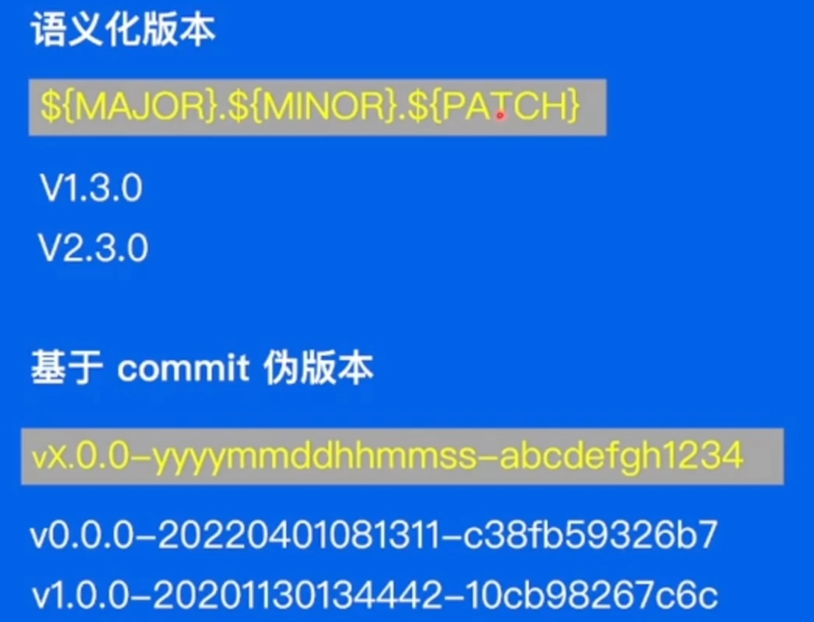

# 语言特性 GO语言为什么快？

go 语言实现了goroutine，轻量级的携程。

Go语言拥抱通过通信而共享内存（使用Channel来在goroutine之间传递数据），而不是通过共享内存来通信（使用锁来保护共享数据，临界区，容易导致数据竞争）

# GO Module 包管理的发展
---
- 第一阶段**GO Path**，所有下载的依赖都放在src中，编译好的包放在pkg中。 因为所有项目使用同一个Go path， 因此无法很好的处理不同项目对包的不同版本依赖问题。
  
- 第二阶段**GO Vendor**， 每个项目都有自己的vendor目录，项目对包的依赖需要**先从vendor中寻找，找不到才区src中寻找**。 解决了不同项目之间的依赖问题，但是包也有自己的依赖，包与包之间的依赖也容易出现冲突。代码膨胀问题。vendor 机制需要手动管理依赖包的版本和更新
  
- 最终阶段 Go mudle。 Go Modules 通过 go.mod 和 go.sum 文件记录项目的依赖信息，确保在不同机器或不同时间构建时使用相同的依赖版本。

> 对比 Go vendor：Go Modules 提供了 go mod tidy、go mod download、go mod vendor 等命令，**简化了依赖的添加、删除、更新和清理过程**。Go Modules 支持语义化版本控制（Semantic Versioning），并能**自动选择兼容的依赖版本**。Go Modules 使用全局缓存存储依赖包，避免了将所有依赖包复制到项目目录下的 vendor 文件夹中，**避免了代码膨胀问题**。

## 包 version

V 大版本 小版本 补丁版本 
- 大版本之间是不兼容的
- 小版本要求之间的兼容的
- 补丁版本是对版本提出了bug修改

commit的版本号： 提交时间+ 提交者的hash值

## 依赖关键字
- indiract 标识是项目的直接依赖包（go.mod还包含包的依赖）
- incompatible  gomod是在较晚版本推出的,那么之前的依赖包是没有mod文件的. 那么规定,如果没有mod文件,且主版本有2+,需要加这个关键字.表示可能存在无法解析的问题.

## 依赖分发:
假设: 目标库的拥有者删除了库,导致了项目的编译失败,那么怎么解决这个问题?

proxy 出现了,它会缓存 目标库的依赖. 当项目再次编译时,会先去proxy中寻找目标库的依赖,如果没有,才会去目标库的仓库中寻找.

# 测试
- **Mock 打桩测试**
> 在测试中,如果测试依赖于外部文件的参与,那么如果外部文件的内容被篡改了,导致测试失败. 因此我们需要打桩测试(把目标函数换成我们自定义的函数),来替换测试对外部的依赖.

- **基准性能测试**
> 和标准测试差不多,但是开头是 Benchmark 开头的. 用来测试函数的性能. 使用命令**go test -bench=**. 来运行基准性能测试.
