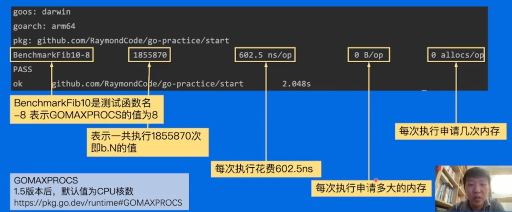

# 如何编写高质量的Go代码
---
## 注释
- 注释应该解释代码的作用
- 解释代码如何做的
- 解释代码实现的原因  （当代码中有上下文的原因导致难以阅读）
- 解释代码什么情况会出错
> 我认为第二点和第四点是必须的

## 命名规范
- 缩略词全用大写，但是当它位于变量开头且不需要导出时，使用全小写。
- 变量名离被使用的地方越远，它的变量名应该携带更多上下文信息。

包名的命名规范：
- 只有小写字母。 不包含大写字母和下划线等字符。
- 不要和标准库同名
- 使用单数而不是复数。

# 性能优化
## -Benchmark
test -Bench=. 下各个参数的意义:

### Slice 大内存未释放
在`已有切片基础上创建切片, 会导致引用底层数组, 导致旧切片得不到释放`.
> 这种情况往往出现在旧切片占用内存较大的情况. 应该使用copy操作来替代切片的重新分配工作

### 空结构体
空结构体不占据任何内存空间，因此可以用来节省内存。
它本省就有很强的语义, 表示不需要任何值. 可以作为占为符号
> 因此占位map中通常使用 map[int]struct{}

### atomic vs mutex
并行编程中,原子操作要比加锁`快的多`
- atomic 是硬件实现,较快,但是通常用于维护保护变量
- mutex 是操作系统实现,较慢,但是通常用于保护逻辑