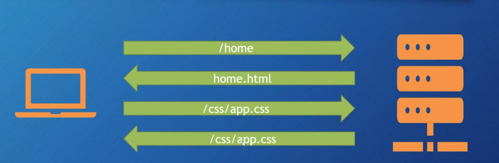
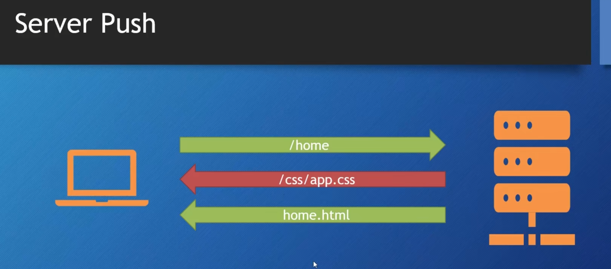
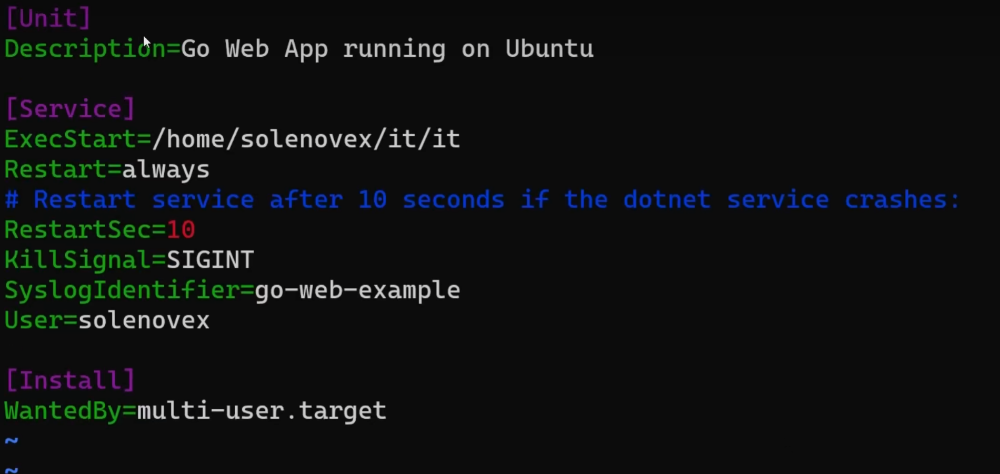

# What is HTTPs
通常来说，http协议下，客户端会对form表单进行URL的==明文==编码，便于服务器理解。 明文，非常不安全
HTTP常用TCP作为传输层。HTTP请求和响应通过TCP连接传输

## TCP
### TCP协议的基本概念

- **面向连接**：在使用TCP传输数据之前，必须在发送方和接收方之间建立一个连接。这个连接是通过三次握手（Three-way Handshake）过程来实现的。
- **可靠传输**：TCP确保数据包能够无误、无丢失、无重复、无乱序地到达目的地。如果数据包在传输过程中丢失或损坏，TCP会负责重传。
- **流量控制**：TCP使用滑动窗口机制来控制发送方的数据发送速率，以防止接收方被过多的数据淹没。
- **拥塞控制**：当网络出现拥塞时，TCP会自动降低发送速率，以避免加剧网络拥塞。

### TCP的工作原理

#### 2.1 三次握手（建立连接）

1. **第一次握手**：客户端向服务器发送一个SYN（同步）包，请求建立连接。
2. **第二次握手**：服务器收到SYN包后，向客户端发送一个SYN-ACK（同步-确认）包，表示同意建立连接。
3. **第三次握手**：客户端收到SYN-ACK包后，向服务器发送一个ACK（确认）包，连接正式建立。

#### 2.2 数据传输

- **分段**：TCP将应用层传来的数据分割成适当大小的数据段（Segment），每个数据段都有一个序列号（Sequence Number）。
- **确认机制**：接收方收到数据段后，会发送一个ACK包，确认已经收到数据段，并告知下一个期望接收的数据段的序列号。
- **重传机制**：如果发送方在一定时间内没有收到ACK包，会认为数据段丢失，并重新发送该数据段。

#### 2.3 四次挥手（断开连接）

1. **第一次挥手**：客户端向服务器发送一个FIN（结束）包，请求断开连接。
2. **第二次挥手**：服务器收到FIN包后，向客户端发送一个ACK包，确认收到断开请求。
3. **第三次挥手**：服务器向客户端发送一个FIN包，表示服务器也准备好断开连接。
4. **第四次挥手**：客户端收到FIN包后，向服务器发送一个ACK包，连接正式断开。

## HTTPs
Https 就是传输数据的时候在TCP上加载了一个TLS层。加密URL信息，保证只有客户端和目标服务器能够解析数据。

go中需要把ListenandServe 改成 ListenandServeTLS

==Http转为Https，http协议自动从1.1转为2.0，效率提高==

# Http/2

**Http/1.1** : 在TCP层中请求和响应都是把Header和body一起传输（当Body比较大的时候就会把Body拆成为多个包一起发送，一般都是绑定），但是**这个Header是绝对不能被压缩的**，所以当请求一多，Header的大小就决定响应速度。
**HTTP/2.2** ：在TCP中建立了独立的管道==Stream==，这个管道内部通过==Frame==传输数据.这个Frame就能保证我们可以把Header Body分开处理发送。
分开后就能单独对某种类型进行解压缩压缩进行优化。此时Header的大小不会影响。因此响应速度快。

## Server Push

http/1.1的工作流程：


Http/2

预先知道你请求这个路径需要的资源，在响应之前先发送资源

```GO
func handleHome(w http.ResponseWriter, r *http.Request){
	if pusher,ok := w.(http.Pusher); ok{
		pusher.Push("CssFILE",&http.PushOptions{
			Header: http.Header{"Content-Type" : []string{"text/css"}},
		})
	}

	t,_ := template.ParseFiles("html","html)
	t.Execute(w,"hello")
}
```

# 部署服务（linux）
在linux启动服务后，
我们可以使用 nohup ./程序 & 来忽略退出信号。
但是服务器重启后，还得登进来重启服务。程序崩溃了也得手动重启。

我们可以设置内核层面，启动服务器自动运行这个程序
```shell
sudo vim /etc/systemd/system/程序文件  // 创建文件
```
内容如下

定义了执行什么文件，是否自动重启，重启间隔。


在web后端中： web api 就是客户端发送的http请求
             api就是后端处理对应http请求的handler！
