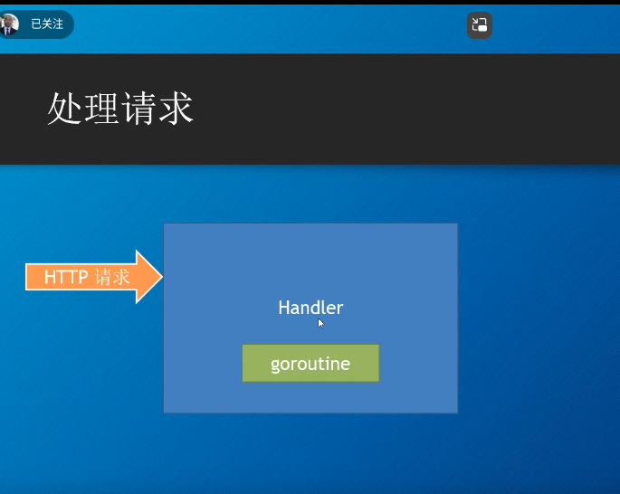
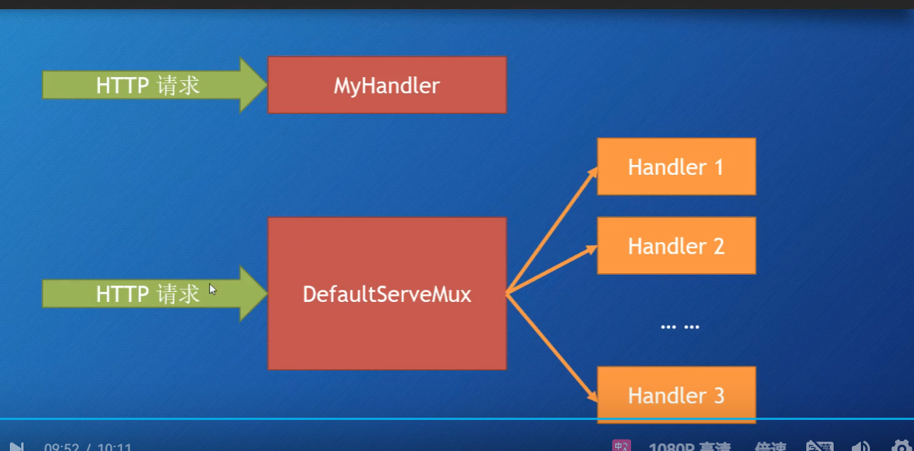
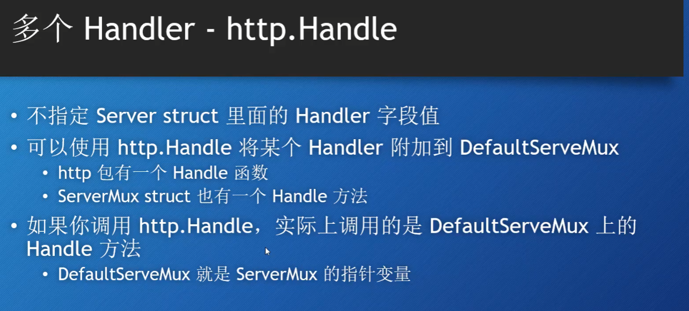
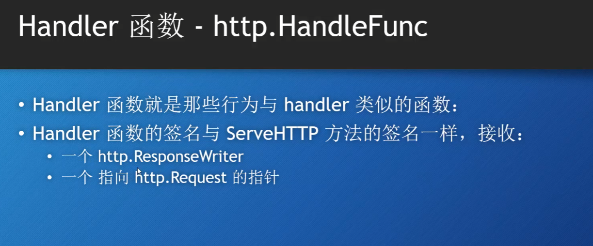
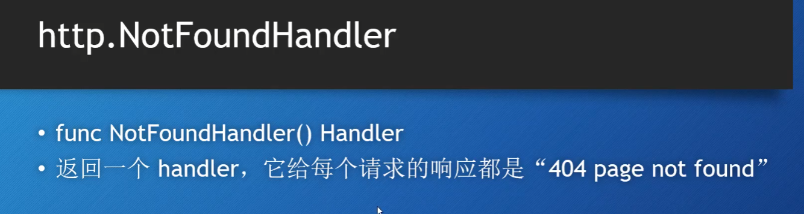
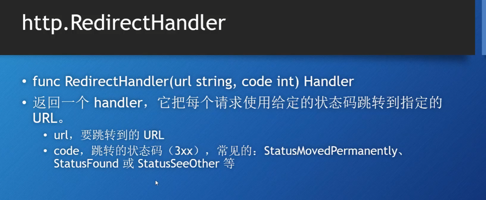
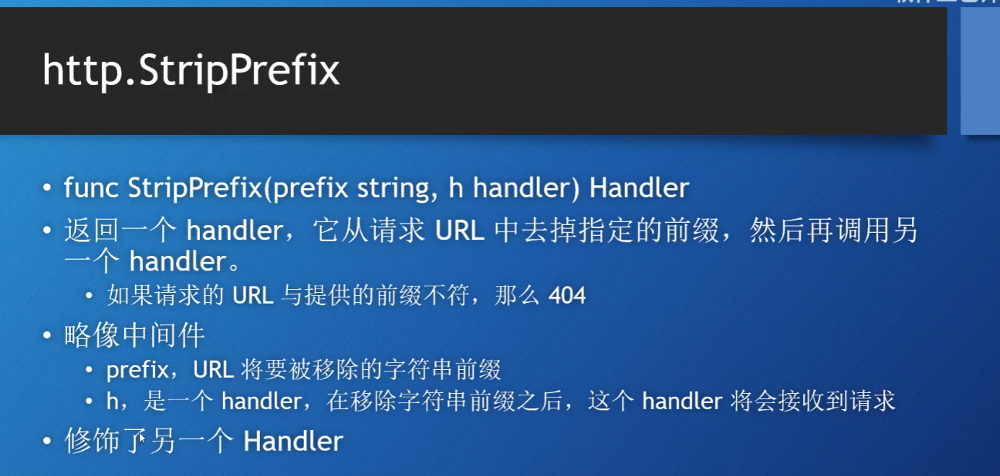
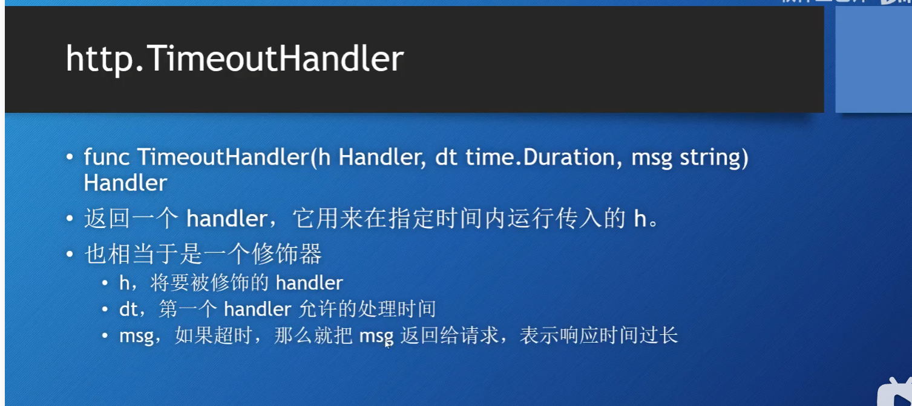
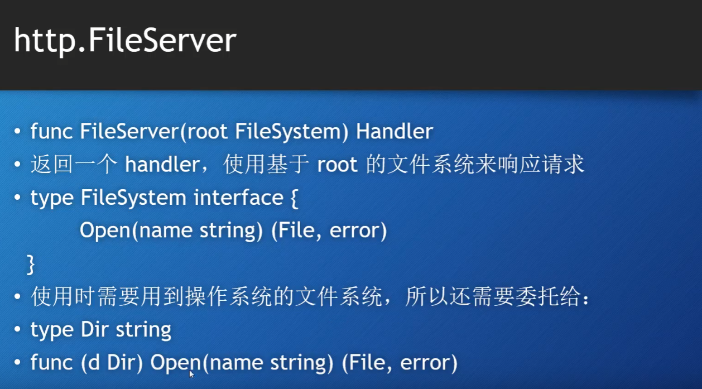

当有http请求时,**handler就会创建一个goroutine去处理请求**


GO中默认的handler就是http.DefalutseverMux,作用类似路由(它的作用是将传入的 HTTP 请求根据请求的 URL 路径分发到相应的处理函数)

handler实际上是一个接口
```GO
type Handler interface{
    SaveHttp(ResponseWriter,*Request)
}
```



**DefalutServeMux 也是一个handler**， 它是常规的handler，需要它来把不同的请求分配给各自对应的handler。

如果自己写一个handler替代了DefalutServeMux的位置，那么只会当http请求到达的时候直接经过myhandler处理返回。 **没有特异性**。

----
# 如何实现有多个Handler

## http.Handle


```GO
package main

import "net/http"

// 分别实现Hanler接口
type Hellohandler struct{}

func (* Hellohandler) ServeHTTP(w http.ResponseWriter, r *http.Request){
	w.Write([]byte("Fuck world!!!!!"))
}

type Abouthandler struct{}

func (* Abouthandler) ServeHTTP(w http.ResponseWriter, r *http.Request){
	w.Write([]byte("About world!!!!!"))
}

func main(){
	mh := Hellohandler{}
	a  := Abouthandler{}

	Server := http.Server{
		Addr : "localhost:8080",
		Handler: nil, // 使用DefaultServeMux
	}
	http.Handle("/Hello",&mh) // 添加Handler
	http.Handle("/About",&a)
	Server.ListenAndServe()
}
```

## http.HandleFunc

源码（原理）就是把HandleFunc的函数通过**http.HanlerFunc**转换成了Handler。
```GO
http.HandleFunc("/",func(w http.ResponseWriter, r *http.Request){
        w.Write([]byte("Game over"))
})

// HandlerFunc不是一个函数，而是一个实现了Handler接口的 基于函数的一个类型。
// 因此Func是显式强制转化成handler。
type HandlerFunc func(ResponseWriter, *Request)

// ServeHTTP calls f(w, r).
func (f HandlerFunc) ServeHTTP(w ResponseWriter, r *Request) {
	f(w, r)
}

```
# 总结


--------
# GO内置的Handler
## http.NotfindHandler


## http.RedirectHandler




**跳转状态码是什么？**
跳转状态码是HTTP协议中的一种状态码，用于告诉浏览器或客户端，请求的资源已经移动到了新的URL。浏览器或客户端会自动根据这个状态码去访问新的URL，就像你根据告示找到新的商店地址一样。

**重定向**：重定向是指服务器告诉客户端请求的资源已经移动到了新的位置，客户端需要再次请求新的URL来获取资源。

**常见的跳转状态码**
301 Moved Permanently：资源已永久移动到新的URL。浏览器会记住这个新的URL，以后访问时直接请求新的URL。

302 Found：资源临时移动到新的URL。浏览器每次访问时都会检查新的位置。

303 See Other：资源可以在另一个URL上找到，通常用于POST请求后的重定向。

307 Temporary Redirect：资源临时移动到新的URL，但客户端应保持原有的请求方法。

308 Permanent Redirect：资源已永久移动到新的URL，但客户端应保持原有的请求方法。

**举个例子**
假设你在浏览器中输入了 http://example.com/oldpage，但这个页面已经移动到了 http://example.com/newpage。服务器会返回一个301状态码，并告诉浏览器新的URL。浏览器会自动请求 http://example.com/newpage，并显示新的页面内容。

## http.StripHandler


## http.TimeoutHandler


## http.FileServer

当你使用 http.FileServer(http.Dir("www.root")) 时，你实际上是在创建一个处理程序，它会处理对 www.root 目录下的文件的请求。

当用户访问类似 /css/style.css 的URL时，服务器会在 wwwroot 目录下查找 style.css 文件并将其返回给客户端.