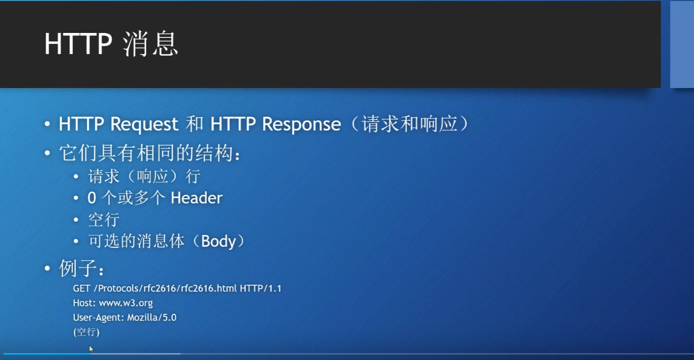
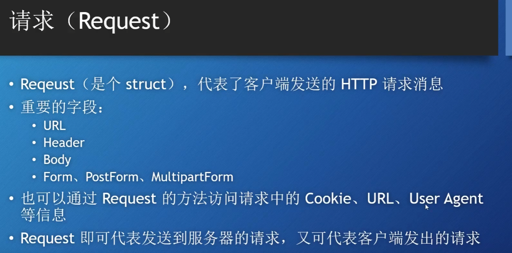
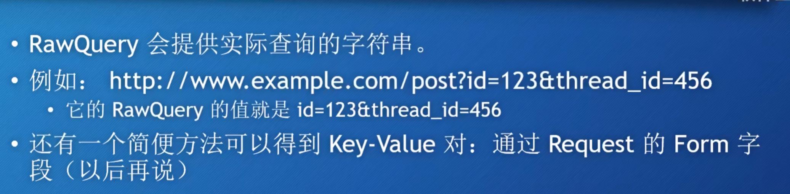
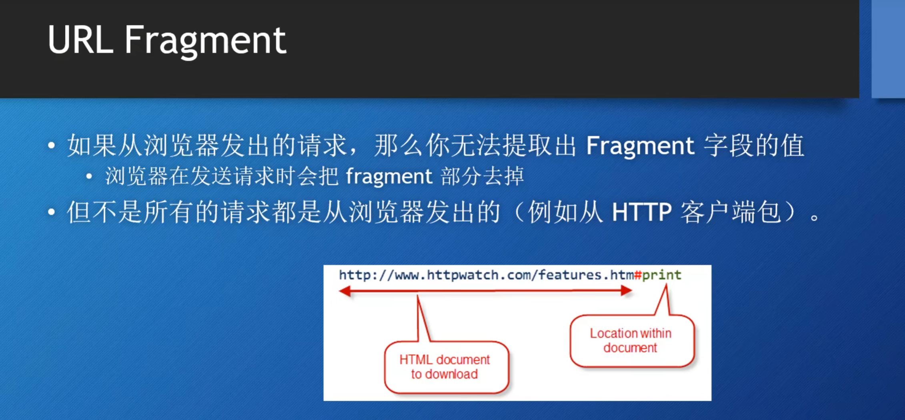

# http消息


请求（响应）行(请求方法、请求URI和HTTP版本) - Header  - 空行 -- 消息体
GO语言中提供了专门表示HTTP消息的结构，就是下文中提到的Request等

## Header
一个键值对，以下是常用的Header：
**Host**：指定请求的主机名和端口号。（网址）
**User-Agent**：包含发起请求的客户端信息。（包含发起请求的客户端信息，通常包括浏览器类型、操作系统等。服务器可以根据这个信息做出不同响应（如适配不同设备的网页））
**Accept**：指定客户端可接受的内容类型。
**Content-Type**：指明请求体的媒体类型（在POST或PUT请求中常用，指定是json或其他）。
**Authorization**：包含用于身份验证的凭据

## Body
Body通常只在Post，Put请求中使用。


# Request

Request是GO http包中表示的Http请求的结构。
Request既可以用在服务端，也可以用在客户端。

## URL的通用格式
```GO
scheme://[userinfo@]host:port/path[?query][#fragment]
```
**scheme** 表示方案 https等
**host**   表示服务器地址，域名等等
**path**    资源在服务器上的具体位置，以 / 开头。
**?query**  查询字符串 ，以？开头
**fragment**    以#开头.指定资源的一个片段或锚点，通常用于跳转到页面的特定部分。


```golang
url := r.Url

query := url.Query() // 返回map
id := query["id"] // 返回切片
thread_id := query.Get("thread_id") // 返回string

```



==fragment==这个东西浏览器会被过滤，一般都会过滤。

## Header
Heaer是使用了map来表示键值对，key 是string类型，value是 []string类型。

如何获得header的例子：
```golang
http.HandleFunc("/header",func(w http.ResponseWriter, r *http.Request){
		fmt.Println(w,r.Header)
		fmt.Println(w,r.Header["Accept-Encoding"]) // 返回[]string
		fmt.Println(w,r.Header.Get ("Accept-Encoding"))  // 返回string，用逗号隔开
	})
```

## Body
请求体中的Body是实现了 io.Readcloser接口，意味有Read方法和Close方法。

读取Body的值只需要Body的read方法就可以了

==它会接收所有与该路径匹配的HTTP请求(POST,GET,PUT等)==


