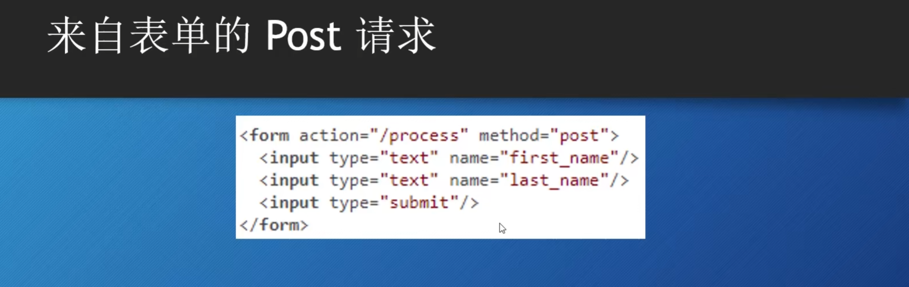
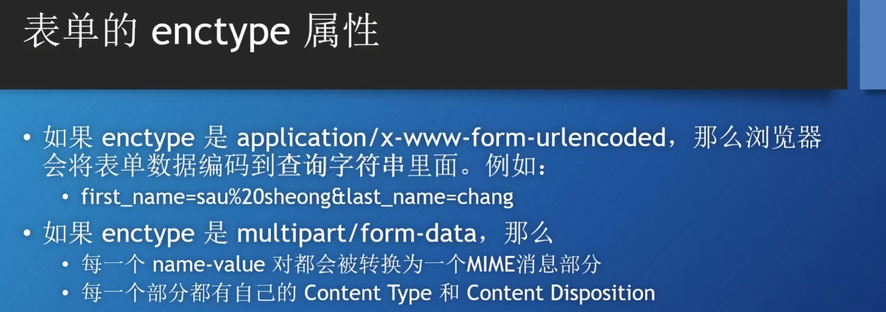
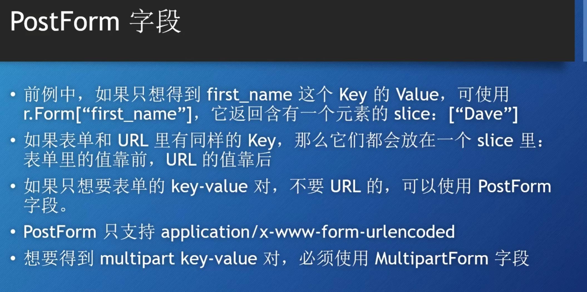

# 通过表单发送请求



## 表单的基本概念
HTML 表单的结构：
一个HTML表单由 <form> 标签定义，并包含各种表单控件（如文本框、单选按钮、复选框、提交按钮等）。

表单控件：
表单控件是用户与网页交互的元素。常见的表单控件包括：

```html
文本输入框（<input type="text">）
密码输入框（<input type="password">）
单选按钮（<input type="radio">）
复选框（<input type="checkbox">）
下拉菜单（<select> 和 <option>）
提交按钮（<input type="submit"> 或 <button type="submit">）
```

文本输入框（<input type="text">）
密码输入框（<input type="password">）
单选按钮（<input type="radio">）
复选框（<input type="checkbox">）
下拉菜单（<select> 和 <option>）
提交按钮（<input type="submit"> 

## 表单的属性：

action：指定表单提交的目标URL（即服务器端处理表单数据的URL）。
method：指定表单提交的HTTP方法，通常为GET或POST。
name：每个表单控件的名称属性，用于标识提交的数据。

表单的name-value对会被保存在http请求的body部分，格式是由表单的enctype决定的。

**application/x-www-form-urlencoded 只能上传数据量小的文本数据**

**Multipart适用于传输包含文件上传的表单数据，或者需要传输多种类型数据（如文本和文件混合）的场景**




# Request的Form字段
Form字段存储的是key-value键值对。

调用request 的 Form字段，首先需要把request请求经过ParseForm处理，然后再访问对应的Form，PostForm等

From 数据实际上也是map[string][]string, 对应每一个name-value对


## MutipartForm
首先需要调用ParseMultipartForm方法，需要传入参数字节大小。


## FormValue Postformvalue 方法
可以不通过ParseForm，而是直接调用上面的方法直接获取对应map的第一个值。

当enctype是Multipart时，FormValue不能读取表单的值，只能得到url对应字段的值。但PostFormValue可以得到表单中的值。

# 上传文件
 multiopart/form-data 最常用的场景就是上传文件
获取文件分为下面的两种方法：
-   首先调用ParseMultipartForm 方法处理request
-   从MultipartForm的File字段中得到FileHeader，调用Open方法获取文件
-   使用ioutil.ReadAll 函数把文件内容读取到切片中。

```GO
r.ParseMultipartForm(1024)

	fileHeader := r.MultipartForm.File["uploaded"][0]
	file ,err := fileHeader.Open()
	if err == nil{
		data,err := io.ReadAll(file)
		if err == nil{
			w.Write([]byte(string(data)))
		}
	}
```

第二种就是FormFile方法。类似Form的FormVlaue方法。
    FormFile("Key")
