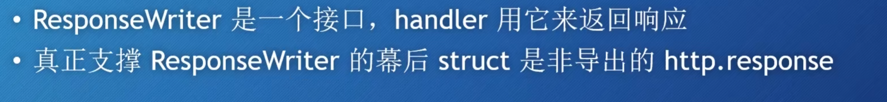
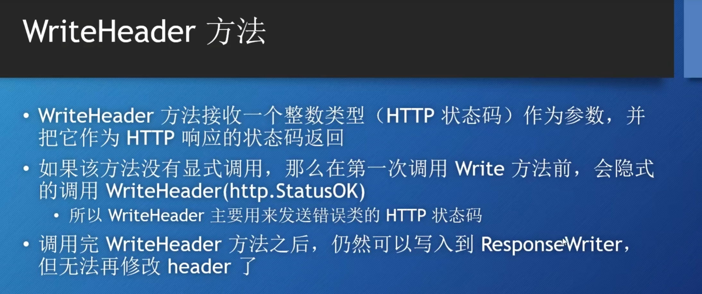
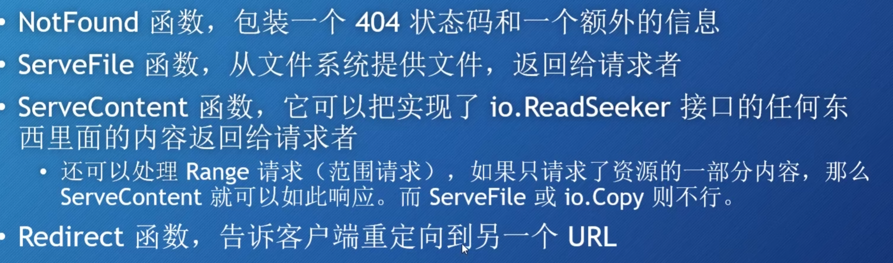

# ResponseWriter本质
---
Response本身也是一个接口，实现这个接口的只有* Http.response。所以其实Response接口**也是指针传递，不是值传递**。



# WriteHeader方法
----


# Header方法
---


==必须要在WriteHeader方法调用之前使用Header方法，因为如果调用了WriteHeader方法，我们就不能修改Header了。==

# 内置的Response
---
- NotFound函数  包含404状态码
 

```go
func notFoundHandler(w http.ResponseWriter, r *http.Request) {
	http.NotFound(w, r)
}

```