# 什么是模板和模板引擎
--- 
 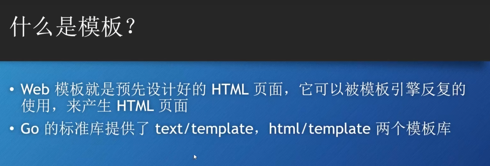

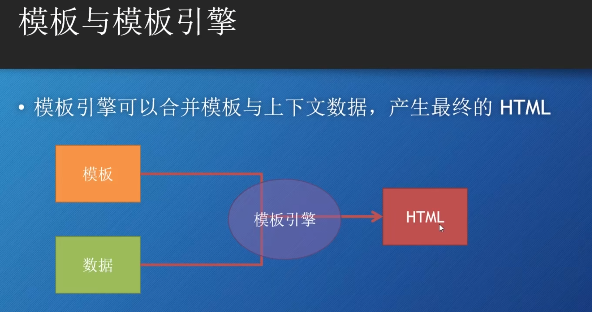

# 两种模版引擎极端：
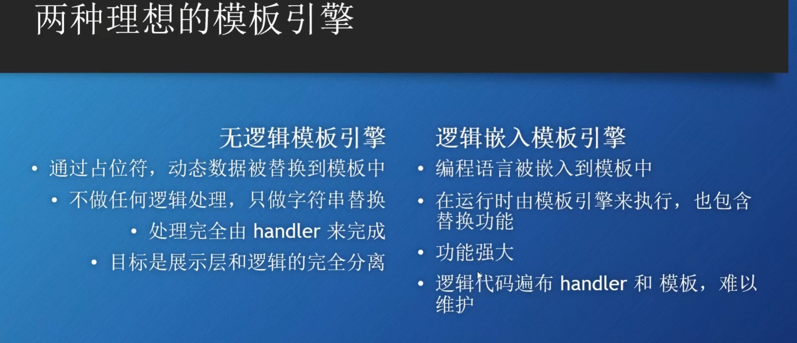
## GO的模版引擎
主要使用 text/template html部分使用html/template。
GO同时支持模版完全无逻辑，也支持嵌入特性，属于两个极端的折中点。

## GO模板的工作原理
- 当http请求来后通过多路复用器传递给对应handler。
- handler会调用模板引擎，其次模板引擎使用模板生成HTML，调用ResponseWriter将html加到http响应中。
  
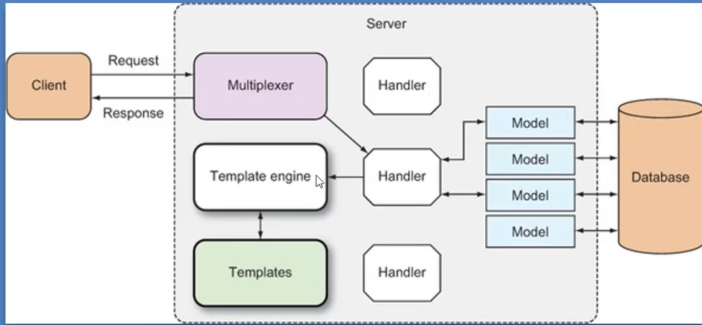

## 模板和使用模板引擎的例子
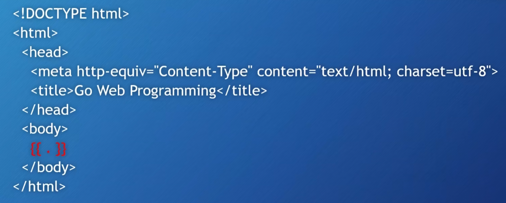
红色部分就是需要替换的部分

```GO
// 写Handler
// 首先调用template来解析模板文件
// 其次调用模板引擎并传入ResponseWriter 和 数据
func templa(w http.ResponseWriter, r *http.Request){
	t,_ := template.ParseFiles("tmpl.html")
	t.Execute(w,"hello world")
}
```

# 解析模板
## ParseFiles

源码解析：
    ParseFiles就是把模板的数据首先转换成字符串，然后更具模板的名字（去掉路径）新创一个模板，调用parse方法再处理数据。

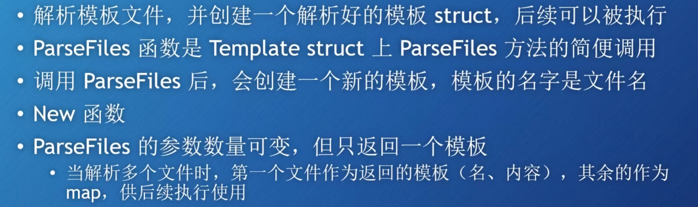

## ParseGlob

```GO
t,_ := template.ParseGlob("*.html") // 传入所有模板，返回的模板是模板容器map，可以通过模板文件名字来索引每个模板。如果你没有明确指定模板，默认会使用主模板（即最初创建的模板对象，第一个解析的模板）。
```

## Parse
解析模板的老大，上面两个函数都调用该了Parse。用来解析模版数据对象。

## 执行模板
```Go
T.Execute(w,"data") // 就算输入多个htmlfile 只会执行进一个html

T.ExecuteTemplate(w,"t2.html","data")// 指定写入的html文件
```

# 使用模板的demo
``` GO
package main

import (
	"html/template"
	"log"
	"net/http"
)

func loadTemplates() *template.Template{
	result := template.New("templates")
	template.Must(result.ParseGlob("/templates/*.html")) // 如果找不到文件就panic，保证了程序的正确
	return result
}

func main() {

	server := http.Server{
		Addr : "localhost:8080",
		Handler : nil,
	}

	templates := loadTemplates()
	http.HandleFunc("/",func(w http.ResponseWriter, r *http.Request) {
		fileName :=  r.URL.Path[1:]
		templat := templates.Lookup(fileName)
		if templates != nil{
			err := templat.Execute(w,nil)
			if err != nil{
				log.Fatalln(err.Error())
			}
		} else {
			w.WriteHeader(http.StatusNotFound)
		}
	})
	
	http.Handle("/css/",http.FileServer(http.Dir("wwwroot")))
	http.Handle("/imag/",http.FileServer(http.Dir("wwwroot")))

	server.ListenAndServe()
}
```

# Action
---
## 定义
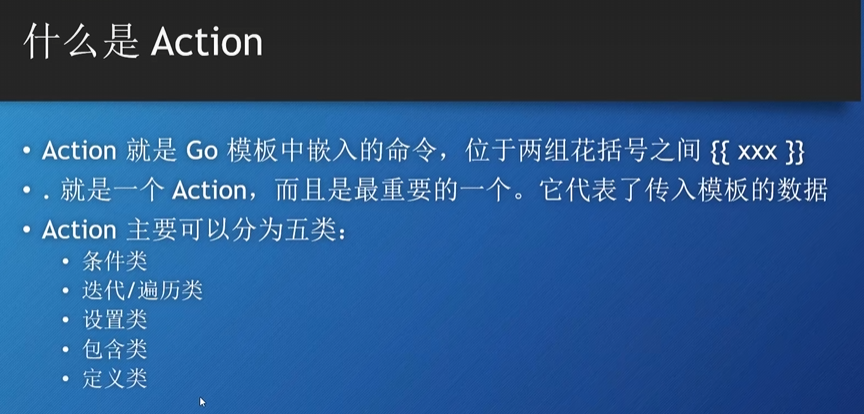

## 条件Action
```go
{{if arg}}
	显示某些内容
{{else}}
	显示某些内容
{{end}}


此时go后端发送bool值
t.Execute(w,rand.Intn(10) > 5)
```

## 遍历Action
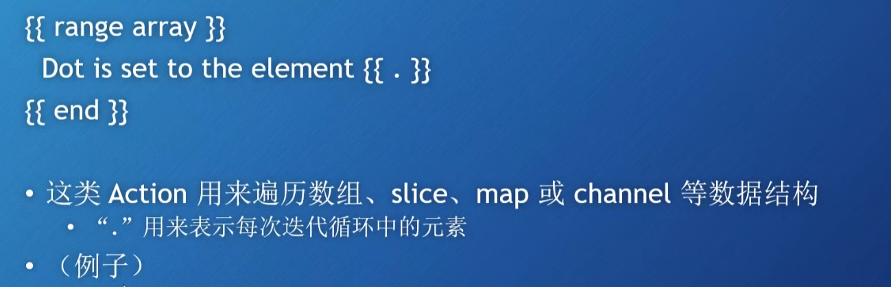

```go
numslice := []string{"1","2","3","4"}
t.Execute(w,numslice)
//传入切片，数组，map等

 		{{ range . }}  // 占位符
        <li> {{ . }}  </li>  // 表示遍历的数据
        {{ end  }}

```
### 回落机制
当range到“”，会执行{{else}}的内容

## 设置Action
```go
{{with arg}}
 .......{{.}}
{{end}}

// 把传入的参数在这个Aciton的有效区域范围内替换成arg
```
## 包含Action
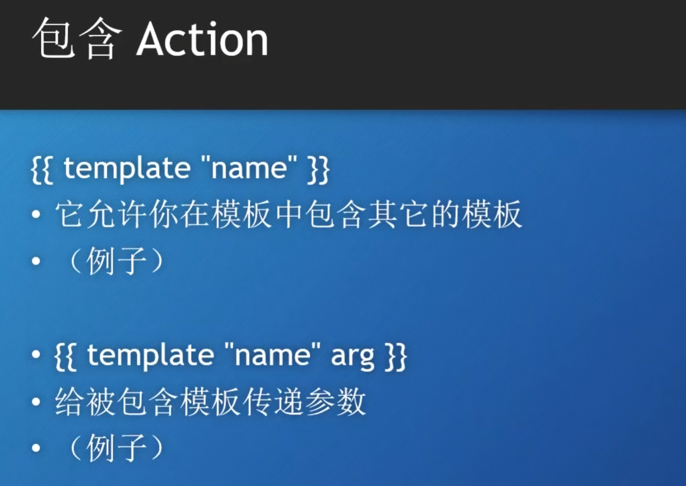

# 函数与管道
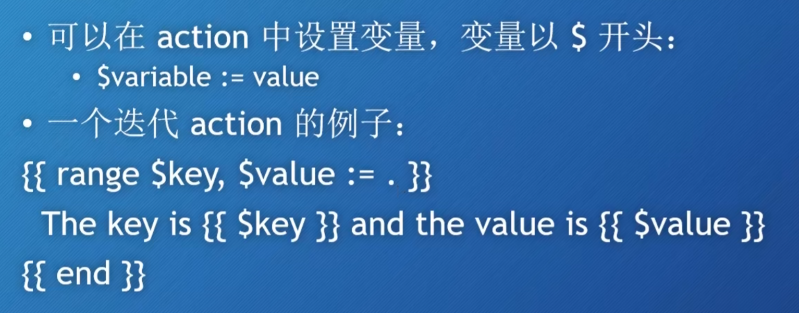
```html
{{ printf "%.2f" 12.345}} //Action 函数没有间隔
```
## 管道
和 unix中的管道差不多
```html
{{ 12.345 | printf "%.2f"}}
```

## 函数
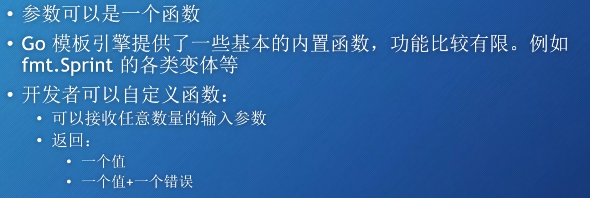

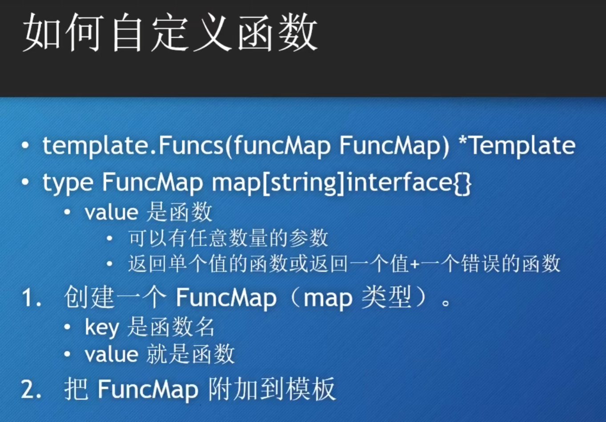
```Go
自定义函数的例子

func formatdata(t time.Time) string{
	layout := "2006-01-02"
	return t.Format(layout)
}

func process(w http.ResponseWriter, r *http.Request){
		funmap := template.FuncMap{"fdate":formatdata}
		t := template.New("index.html").Funcs(funmap)
		t.ParseFiles("index.html")
		t.Execute(w,time.Now())
}

```

# layout模板
---

layout 模板就是网页中固定的部分，可以被多个网页重复使用，就比如每个网站的页脚备案部分。

实现方式：
对于每一个网页，我们都要先试用layout模板，实现固定的内容然后再使用包含Action调用网页的差异内容。
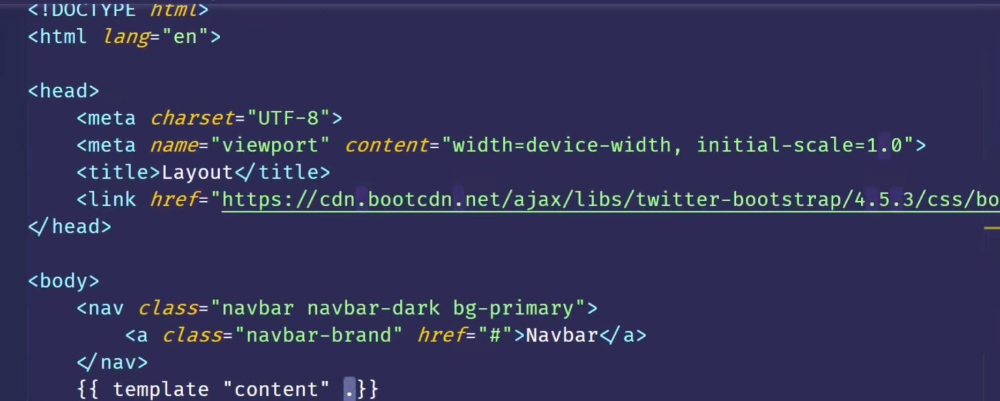

使用细节：
我们在Layout html中要使用包含Action指定跳转的其它模版。这里使用统一名字。
其次其它模板中都用define Action定义成一个统一名字的模板。

在包含Action中 还可以使用
```html
{{ block "content"}}
	110
{{ end }} // 也是有包含的意思，但是多了一层保证，如果没有找到对应包含的html就执行块内的。
```

## 逻辑运算符
- eq/ne := and != 
- lt/gt : 小于 and 大于
- le/ge ： 小于等于 and 大于等于
  
{{ if eq . "HELLO"}}

{{ end }}


