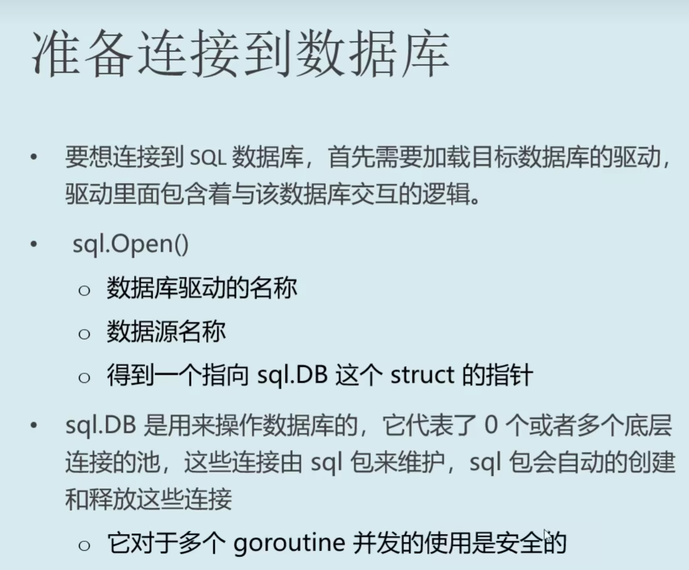
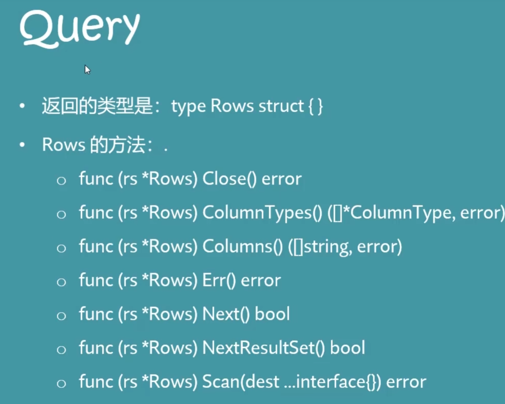

# 连接到数据库


 **Open函数并不是连接数据库，只是把数据库连接需要的struct设置好了，真正的连接是在被需要的时候进行懒设置的。**

## 驱动自动注册

这样的好处是换数据库和换驱动都十分简单,只需要换一行代码

```Go
package main

import (
	"context"
	"database/sql"
	"fmt"
	"log"

	_ "github.com/lib/pq"
)

const(
	user = "postgres"
	password = "YZN700563"
	database = "GO_database"
)

func main(){
	connStr := fmt.Sprintf("postgres://%s:%s@localhost:5432/%s?sslmode=disable",user,password,database)

	db,err := sql.Open("postgres",connStr)
	if err != nil{
		log.Fatalf("无法连接数据库",err)
	}
	defer db.Close()

	ctx := context.Background()
	err = db.PingContext(ctx)
	
	if err != nil{
		log.Fatalf("无法PING通",err.Error())
	}

	fmt.Println("连接成功")
}
```

# CRUD
Go语言的标准库提供了database/sql包，这是一个通用的SQL数据库接口，可以与多种数据库驱动配合使用。这意味着你可以使用相同的API来执行查询、插入、更新和删除等操作，无论你使用的是MySQL、PostgreSQL、SQLite还是其他任何支持SQL的数据库。

## 查询
Query 返回多个结果
QueryRow 返回一行结果

```GO
type App struct{
    time
    name
    Id
}


func getone()  (a  App, err error){
    a = App{}
    err = db.QuerryRow("Select ........... from ...").Scan(&a.Id,&a.name..........)e// Scan方法把查询结果赋值给变量
}

func getMany()  (a  App, err error){
    rows,err := db.Querry("Select ........... from ...")

    for rows.Next(){
        a = App{}
        err = rows.Scan(&a.Id,&a.name)
    }
}
```

## 其他
Sql.DB 中的 db.Exec(sql 语句)

在Go语言的数据库编程中，Prepare函数是一个非常重要的函数，它用于创建一个预处理语句（Prepared Statement）。预处理语句是一种在数据库服务器上预先编译的SQL语句，它可以提高SQL语句的执行效率，并且有助于防止SQL注入攻击。

```GO
import (
    "database/sql"
    _ "github.com/go-sql-driver/mysql" // 假设使用MySQL数据库
)

func main() {
    // 打开数据库连接
    db, err := sql.Open("mysql", "user:password@tcp(127.0.0.1:3306)/dbname")
    if err != nil {
        panic(err.Error())
    }
    defer db.Close()

    // 准备预处理语句
    stmt, err := db.Prepare("INSERT INTO table_name (column1, column2) VALUES(?, ?)")
    if err != nil {
        panic(err.Error())
    }
    defer stmt.Close()

    // 执行预处理语句
    _, err = stmt.Exec("value1", "value2")
    if err != nil {
        panic(err.Error())
    }
}
```


 

