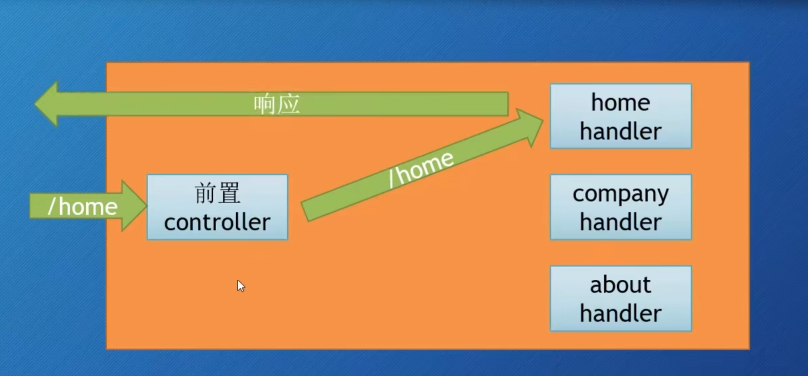

我们目前为止把设置handler和设置http sever的函数放在一个main函数里，这样是不规范的。 我们应该设置一个Controller层

main ： 设置类工作
controller ： css等静态资源。路由：把不同的请求送到不同的Controller处理。

# 路由结构

正确的写法是
- 创建一个Controller文件夹，先创建一个controller.go文件 总领全局
- 其次 为各个handler都分别创建一个go文件，用来注册目标名字的路由handler。

# 路由参数

第三方路由器也值得关注：
gorilla and httprouter

