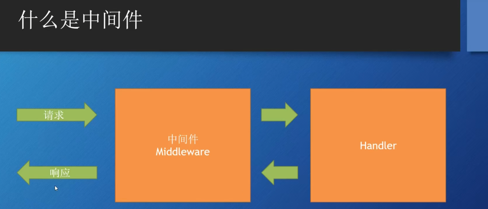
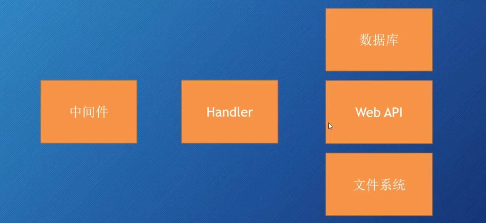
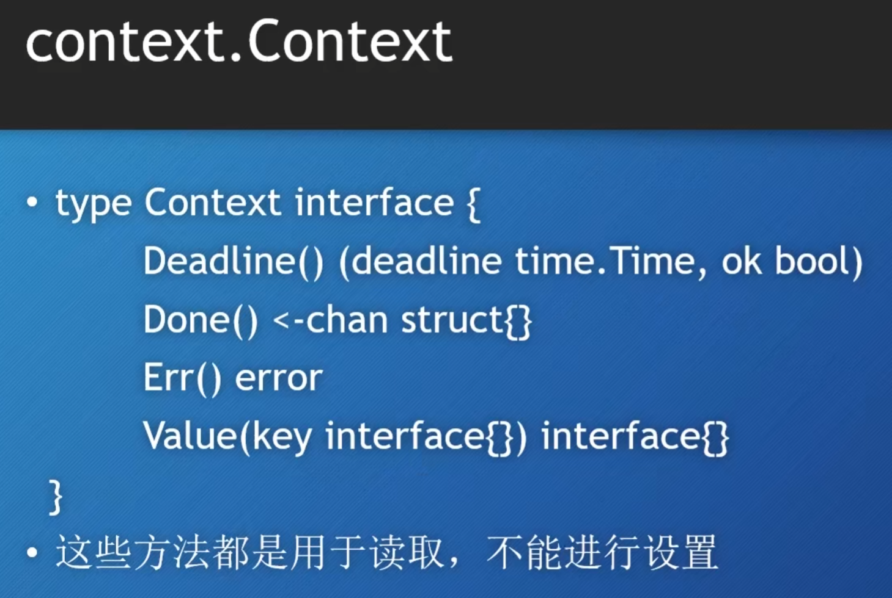
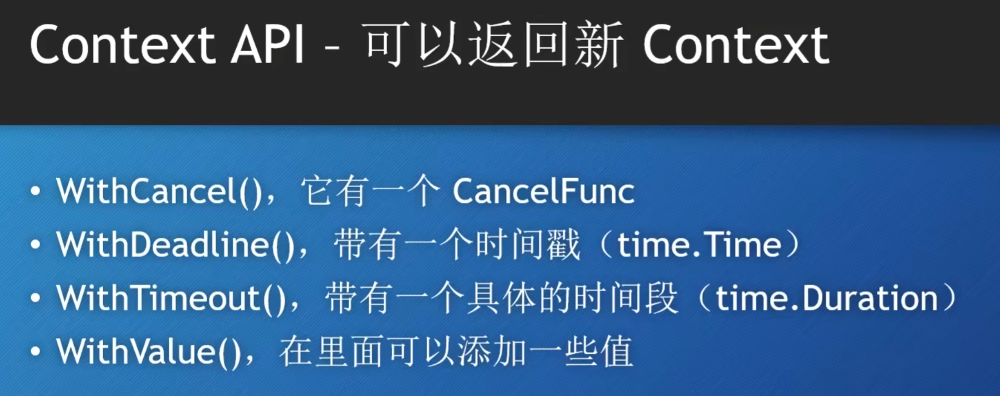

# 什么是中间件？


可以对发送过来的请求和处理完成的响应进行操作。

# 如何创建中间件？
```GO

type MyMiddleware struct{
    Next http.Handler
}

func (m MyMiddleware)ServeHTTP(w http.ResponseWriter, r *http.Request){
    /////  进行http请求的预操作
    m.Next.ServeHTTP(w,r)
    ////  对响应进行处理
}

```

# 中间件的用途
Logging 记录日志
安全认证
判断请求超时

# 请求上下文

Handler可能需要调用mode层来实现业务逻辑，但是mode层  例如数据库就需要http请求的上下文信息  中间件设置了请求超时为30s，数据库就要获取这个30s 超过这个数就停止操作。 此时就需要请求上下文。

## Request Context

```Go
func (*Request) Context() context.Context{
 // 返回当前请求的上下文
}

func (*Request) WithContext(ctx context.Context) context.Context
// 基于Context 进行修改，创建一个新的Context
```




```GO
ctx := r.Context()
	ctx = context.WithTimeout(ctx,3*time.Second)

	r.WithContext(ctx)
```
