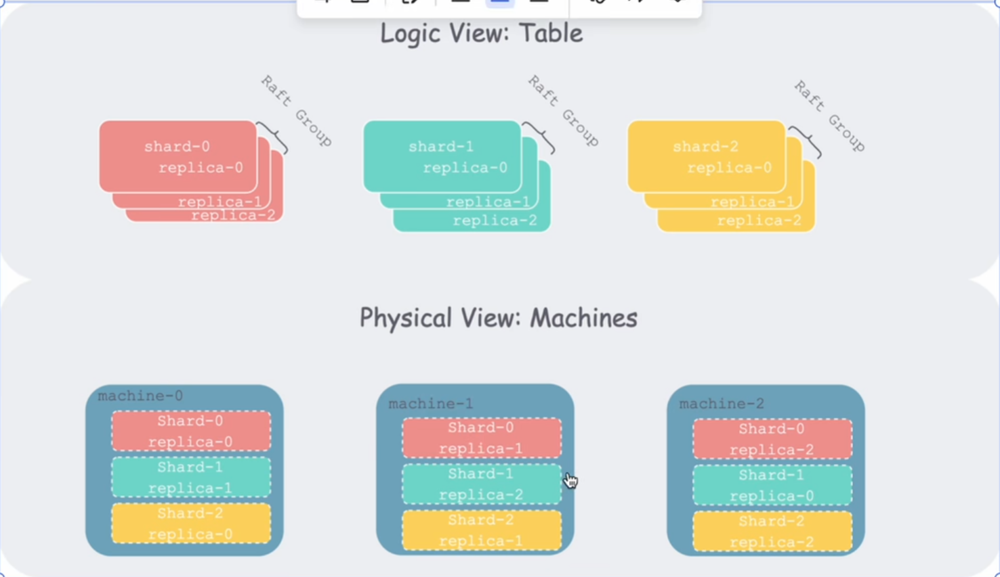
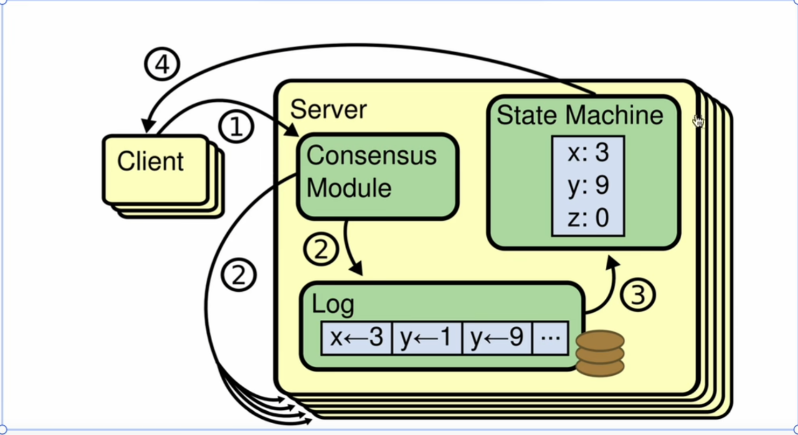
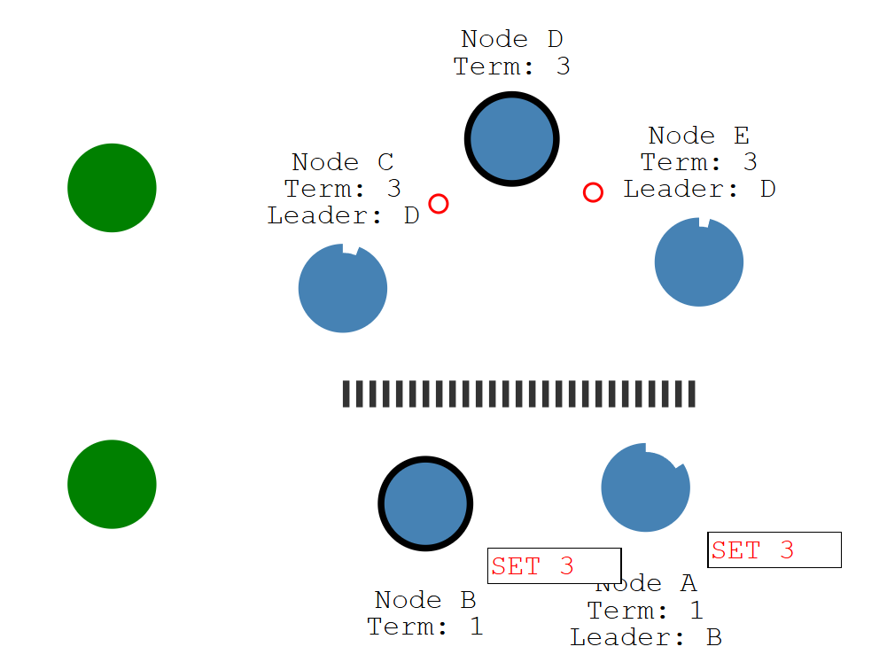

# 使用背景
Raft本质上是一个**共识算法**。

- 随着互联网发展，数据不断膨胀，数据库里的一个table的数据增长到一定的地步后，**单机一定无法存储**。此时呢，我们可以把数据按照某种方式（range方式，hash方式）切成多个分片。 把多个分片分别分布在分布式架构的每台主机上。 但是主机集群一旦庞大，**单个机器的运行故障是在所难免的**。我们为了能够容忍这个运行故障，可以把单个切片的**副本冗余存储到其他主机**上。 此时有切片在不断写入数据，从属于这个切片的副本由于网络故障等问题，很难保持数据的一致性，此时就需要**共识算法**

# 基本原理
Raft会把客户端请求序列换成操作日志，Raft会确保Raft的所有服务器（Raft Server）的操作日志一致。
Raft Group 就是集群中不同节点中相同切片的Group
Raft Peer和Raft Server通常可以互换使用，它们指的都是参与Raft协议的节点

Client ： Raft的客户端，发送写请求
Raft Server ： 组成Raft的单个进程。Raft由多个Raft Server组成。

第一步 ： 客户端发送请求，写入数据
第二步 ： Raft把数据序列化成数据，写入本地log。同步到其他Raft Server。
第三步 ： 当同步化后，log一致再把各自的log 应用到状态机、
第四步 ： 客户端再读的时候，就会读取写入状态机的最新数据。

# 实现概要
为每一个Raft Server创造一个Struct，每一个Raft Server会维护一个无限长的**操作序列**，每个操作也叫做日志条目，一旦日志条目在多个机器达成共识，我们就对这个操作进行**提交**，只有提交后的日志，才能引用到状态机。**为了实现这一点，Raft使用了类似TCP序号的机制来跟踪操作的顺序。**

## TCP序号和Raft算法的联系
- **TCP序号的作用**：每个数据段在传输时都会被分配一个序号，接收端通过这些序号来将数据段按正确的顺序重新组装，并检测是否有数据丢失。
- **Raft**也需要类似的机制来跟踪操作的顺序，操作顺序混乱会导致BUG。
- **操作的顺序**：在Raft中，每个操作都会有一个递增的编号（类似TCP的序号），称为日志索引（log index）。这个编号确保了所有节点都能按照相同的顺序执行操作。
- **达成共识**：当一个操作被提议时，Raft会将该操作添加到每个节点的日志中，并尝试在大多数节点上达成共识（即同意这个操作的顺序）。一旦达成共识，这个操作就被"提交（commit）"，并可以应用到系统的状态机中。
  
# 任期
任期（Term）在Raft中起到了一种“时间戳”的作用，帮助系统区分不同的“时间段”并管理领导者选举。一旦任期增加，旧的任期内的领导者和操作都会被视为无效，确保系统在面对故障时能够安全地达成共识

在每个任期内，可能会进行一次领导者选举。当一个节点检测到当前没有有效的领导者（如未收到领导者的心跳信息），它会增加自己的任期号，并尝试发起选举，成为新的领导者。在选举过程中，每个节点会投票给它认为最合适的候选人。一个节点要成为领导者，必须获得大多数节点的投票，这个过程是在同一个任期内完成的。

## 任期的使用：

- **一致性检查**：节点通过对比任期号来确保它们与集群中的其他节点保持一致。如果一个节点的任期号落后于其他节点，它将更新自己的任期号，承认自己不再是领导者，并转为追随者。
- **冲突解决**：在日志复制时，如果节点发现收到的日志项的任期号低于当前的任期号，它会拒绝该日志项。这有助于防止在不同任期之间产生的数据冲突。

**心跳机制：**
领导者会定期发送心跳信息（AppendEntries RPC）给追随者，这些信息包含当前的任期号。通过这种方式，追随者知道当前任期的领导者仍然存活，并会保持追随者状态。

## 例子：

假设有一个Raft集群，由三个节点组成：**节点A、节点B 和 节点C**。

- **开始新的任期**：在某个时刻，**节点A**成为领导者，并且当前的任期号是1。节点A定期发送心跳消息给**节点B和节点C**，表示自己是领导者。

- **网络分区或领导者失效** ：假设由于网络分区，节点A与节点B和节点C失去了联系。节点B和节点C在一段时间内没有收到节点A的心跳消息，它们认为领导者可能已经失效，于是节点B和节点C会各自增加任期号（变为2），并发起选举。

- **选举新的领导者**：假设节点B比节点C更早发起选举，并且获得了大多数投票（包括自己的投票），节点B成为新的领导者，当前任期号为2。此时，节点A如果重新恢复了网络连接，发现自己的任期号（1）落后于当前的任期号（2），它会承认自己不再是领导者，转为追随者，并更新自己的任期号为2。

- **继续工作**：节点B作为新的领导者，继续在任期2内发送心跳消息，节点A和节点C作为追随者响应这些消息，整个系统继续保持一致性

# 领导选举
Raft使用的是“皇帝选举”，Leader对日志长什么样有说一不二的权力。
因为Leader权力很大，选Leader的时候要格外小心，要选出**具备所有已提交日志**的**候选者**。为此，每个raft选举时要比较谁的日志更全。一旦**追随者投出票**的同时，表示对Leader心悦诚服，重置选举时种，一段时间不发起选举。

Leader当选后“昭告天下”（心跳），迫使每一个追随者都重置选举时钟，只要追随者的任期没有Leader大，就只能乖乖照做。

之后Leader会周期性的发送政令，直到收到高任期的心跳，交出政权。

节点三种状态：Follower Leader Conditate
# 日志同步
Leader怎么发送政令？

领导者通过发送AppendEntries RPC（远程过程调用）将这个日志条目复制到所有追随者节点。这个RPC包含了新的日志条目、领导者的任期号，以及前一个日志条目的索引和任期号（用于一致性检查）。

追随者节点接收到AppendEntries RPC后，检查前一个日志条目的索引和任期号。如果追随者的日志和领导者的日志一致，追随者就会将新的日志条目附加到自己的日志中，并回复领导者确认（acknowledgment）。

一旦领导者收到大多数节点的确认，领导者就认为这个日志条目已经被“提交”了（committed）。领导者会将该日志条目应用到自己的状态机中，并通知追随者将其应用到各自的状态机中。

# 工作流程

- 一开始我们的所有节点都以追随者状态启动，如果追随者没有收到Leader的心跳，它可以成为候选人。

- 候选人首先向其他节点发送请求投票。节点回复他们的投票，如果获得大多数节点的选票，则该候选人成为领导者。对系统的所有更改都要通过领导者。
- **当日志被提交才会进入状态机**。领导者收到日志后，请求同步。同步的过程中，领导者收到大多数FOllower返回的已接收标志，则会提交日志，通知追随者们已提交。然后整个集群现在已经达到了共识。 **日志复制**

## Raft领导选举，
在Raft中，有两个超时设置来控制选举。
- **选举时钟** ： 追随者成为候选人之前等待的时间。
- 选举超时后成为候选人，随后给自己投票，给其他节点发送邀请投票的信息。如果接受节点在此期限期间尚未投票，则把它投给候选人。投票后重置它的选举时钟。
- **心跳时钟** ： 当候选人得到大多数选票后，成为领导者。 此时每个一个心跳时钟就会向追随者发送心跳（政令）。**这个选举任期直到追随者停止接受心跳成为候选人**

==如若两个跟随者都成为了候选者，此时他们同时开始拉票，如果正好票数一样多。那么此时就会重新等待一个选举时钟，开始第二次的选举。==

## 日志复制
通过领导者把所有的更改复制到所有节点，通过Append Entries message （同时也负责心跳机制）来完成的。

当领导者收到更改日志后，把它写入本地log，然后通过心跳发送给追随者。**当大多数追随者接收到它，那么领导者就会提交它**，并向客户端和追随者发送响应。此时领导者和追随者会把这个改动写进自己的状态机。

**当网络分区后，和领导者隔离的追随者中后续会自己选举成新的领导者**

当客户端发送数据给B节点这个领导者，但是因为这个分区内只有俩个节点，无法复制到多个节点，所以这个日志条目只能保持未提交状态。

如果给D节点发送更改日志，这个日志会复制到大多人，是可提交状态。
此时修复了网络分区，此时原来的Leader向所有人发送心跳，发现有比自己更高的任期自觉下台。并匹配新领导人的日志。

