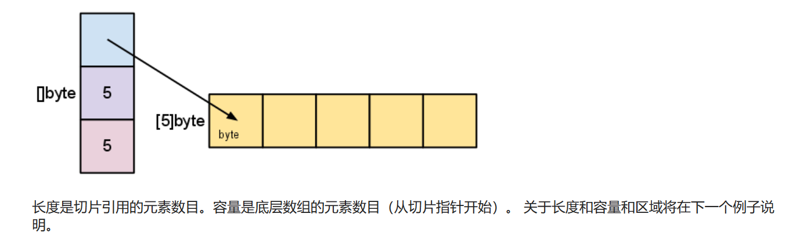

#基础
1.Go语言编译器会默认在每一行后面加一个分号，因此声明的函数的左括号一定和函数名在一行且每个语句都不需要加分号；

2.在go中函数外的每一个句子都要以关键字开头，因此 := 只能在函数中用

3. 在GO中，我们一定要记住它无法像C一样赋值时，自动的从低精度向高精度进行隐式转换。需要我们进行显示转换。
    
4.常量（CONST）不能使用:=。其他类似C++中的模版，是在运行过程中才真正生成的代码，其他时间都是假代码，没有分配内存。 而常量一定要在运行前就知道值是什么，所以不能用:=

5. 一个未指定类型的常量CONST 是根据上下文来决定其类型。**一个未指定类型的常量的类型，取决于它在程序中的使用环境。编译器会根据上下文，自动推断出它应该转换为哪种类型。例如，如果一个无类型的常量被赋值给一个变量，那么它的类型就是变量的类型。如果一个无类型的常量作为函数的参数，那么它的类型就是函数期望的类型。如果一个无类型的常量参与了运算，那么它的类型就是运算结果的类型。**

6. for就是GO中的while，当只有一个参数时就是C中的while
   
7. Go允许在if的执行表达式前执行一个简短语句。但切记==在这个语句中声明的变量作用域仅限于if 和 else 块==

```
    if v := math.Pow(x, n); v < lim {
		return v
	} else {
		fmt.Printf("%g >= %g\n", v, lim)
	}
```

8. Go的switch语句是会在每一个case后面自动加上break的。而且case的值不需为常量，也不必为整数。
    
9. defer 会推迟调用函数，等到外层函数返回完毕后在调用。遇到defer会立即求值，只不过是在外层函数执行完毕后调用而已。  如果多个defer调用，会把defer的函数放入栈中，先进后出。
    
10.在C/C++ 中他们如果有指向结构体的指针P，那么他们可以 P->x 来访问结构体，他代表的是(*p).x 在GO中，直接写P.x  与结构体名是一样的

11.切片是半开区间，包括第一个元素，但排除最后一个元素。切片类似于数组的引用，它本身没有分配存储空间，更改切片会影响到其底层数组中对应的元素，和它共享底层的切片都会观测到这些修改。

12.Go中未初始化的变量和数组都是默认设置为该类型的零值。

13. **... 语法**，...叫做任意参数符和参数展开符。我们定义函数的时候可以 func sums（nums... int），表示函数可以输入任意数量的int类型的参数，统称为nums。对于切片，nums...表示nums切片展开。

 
##数组

数组名就是代表整个数组，不是和C一样代表着首元素的指针。==当一个数组变量被传递的时候，实际上是复制了整个数组==

       在GO中使用的多的是切片，而不是数组。

切片零值为nil，切片的实质：

    切片操作并不辅助原数组，只是创造新的切片指向原数组，因此比较高效。

使用方法：
 ```
创建切片：
	使用make函数：s := make([]int, 0, 5) 创建一个长度为0，容量为5的切片。

切片的长度和容量：
	使用len(s)来获取切片的长度。
	使用cap(s)来获取切片的容量。
访问和修改元素：
	通过索引访问：s[0] 获取第一个元素。
	通过索引修改：s[0] = 7 将第一个元素修改为7。
	追加元素：

	使用append函数：s = append(s, 4) 向切片追加一个元素。
切片截取：

	使用[start:end]来截取切片：s[1:3] 截取索引1到2的元素。

复制切片：
	使用copy函数：copy(destSlice, srcSlice) 将srcSlice复制到destSlice。

遍历切片：
	使用for循环或for range循环来遍历切片中的每个元素。
 ```

15.当使用for,range循环的时候，会返回两个值。第一个值为当前元素的下标，第二个值为当前下标对应元素的==副本==
```
 for i,v =range pow{

 }
```
我们可以使用_来选择忽略一个返回值。

16.哈希表中用来判断元素是否在表中的方法是：
```
var m map[string]Vertex
m = make(map[string]vertex)  //创造哈希表

elem,OK := m[key]
```
OK的bool值可以告诉我们它在不在表中。如果不在表中，elem的值就为零值。

17.函数可以当做一个值，他可以当做函数的参数和返回值。
```
package main

import (
	"fmt"
	"math"
)

func compute(fn func(float64, float64) float64) float64 {
	return fn(3, 4)
}

func main() {
	hypot := func(x, y float64) float64 {
		return math.Sqrt(x*x + y*y)
	}
	fmt.Println(hypot(5, 12))

	fmt.Println(compute(hypot))
	fmt.Println(compute(math.Pow))
}

```

18. ==当函数返回值是函数的时候，可以用:=来初始化这个返回的函数==
函数的闭包即函数内部的函数和它的引用环境。
```
package main

import "fmt"

func adder() func(int) int {
	sum := 0
	return func(x int) int {
		sum += x
		return sum
	}
}

func main() {
	pos, neg := adder(), adder()
	for i := 0; i < 10; i++ {
		fmt.Println(
			pos(i),
			neg(-2*i),
		)
	}
}
```
上文中，adder返回为闭包，它引用了adder函数内部的sum变量，则我们可以通过调用这个闭包修改和查询adder这个函数sum变量的值。

#方法和接口

1.Go中的没有类，但是我们可以为结构体添加方法，从而可以模仿面对对象编程中类的行为。
```
func (v Vertex) Abs() float64{
	return math.Sqrt(v.X*v.X + v.Y*v.Y)
}

func main() {
	v := Vertex{3, 4}
	fmt.Println(v.Abs())
}
```
==接收者的类型定义和方法声明都必须在同一个包里面==

2.我们不仅能为结构体声明方法，我们还可以为非结构体类型等声明方法。当我们设置接收者的时候，我们常用的是**指针接收者**，**这是因为我们使用指针接收者我们可以更改结构体的内部变量数值**
若为值接收者，方法就会对值的副本进行操作。

3.当以指针为接收者的方法被调用时，接收者既能接收值也能接收指针，这是因为GO会自动把v看做（&v）。反过来，如果以值为接收者，接收者也能是指针。==接受者和接受的参数时分开来的==
```
v.Scale(),v 就是接受者的类型。
```

4.在go中，编译器会直接先处理各种声明，然后执行main函数。所以，无论方法等声明在main函数后面，也可以在main中使用。

5.接口的基本使用方法
 先声明接口
 其次实现接口
 在main中定义接口类型的变量，定义实现了接口的类型变量
 给a这个接口赋值，从而可以使用函数

 类型通过实现一个接口的所有方法来实现该接口
```
package main

import (
	"fmt"
	"math"
)

type Abser interface {
	Abs() float64
}

func main() {
	var a Abser
	f := MyFloat(-math.Sqrt2)
	v := Vertex{3, 4}

	a = f  // a MyFloat 实现了 Abser
	a = &v // a *Vertex 实现了 Abser

	// 下面一行，v 是一个 Vertex（而不是 *Vertex）
	// 所以没有实现 Abser。
	a = v

	fmt.Println(a.Abs())
}

type MyFloat float64

func (f MyFloat) Abs() float64 {
	if f < 0 {
		return float64(-f)
	}
	return float64(f)
}

type Vertex struct {
	X, Y float64
}

func (v *Vertex) Abs() float64 {
	return math.Sqrt(v.X*v.X + v.Y*v.Y)
}

```
6.接口本身也是一个值（也可以当做参数和返回值），它包含了底层类型和接口的具体值。 接口调用方法的时候会调用底层类型相同的方法。底层值（Underlying Value）：这是实现了接口的具体变量的值。例如，如果我们有一个Stringer接口和一个MyString类型的变量ms实现了这个接口，那么ms的值（比如说是"hello"）就是接口的底层值。
底层类型（Underlying Type）：这是实现了接口的具体变量的类型。在上面的例子中，MyString就是底层类型。

7.底层值为nil的接口值，它也可以调用方法。==保存了nil值的接口不代表接口本身是nil== 接口本身为nil值运行错误。

8.空接口是一个强大的特性，因为空接口中没有方法，所以所有类型都实现了空接口。我们可以把所有类型的值赋值给空接口。利用这个我们可以编写应对所有类型函数的方法和函数。**fmt.Print 函数就使用了这个特性。它的参数是 ...interface{} 类型，这意味着你可以传入任意数量和任意类型的参数。函数内部会通过类型断言或反射来处理这些参数。**

9.类型断言；
```
基本语法：
	t := i.(T)
	断言i接口的底层类型是T，如果是则把底层值赋值给t，如若不是则终止程序出现panic

	t,ok := i.(T)
	如果是则把底层值赋值给t，ok为true。如若不是则t值为零值，ok为false，不会终止程序，不会出现panic
	
```

10.类型选择:
	语法和switch差不多，只不过当case的值不是值而是类型。
```
switch v := i.(type) {
case T:
    // v 的类型为 T
case S:
    // v 的类型为 S
default:
    // 没有匹配，v 与 i 的类型相同
}
```
与断言不同的是，关键字就是固定的type。

11.
通常呢，函数都会返回一个error，我们可以使用if ret，error = func，来处理error。
如若我们想为我们的函数自己写一个error处理，我们可以按以下步骤：

1.第一步：创建新类型
```
type ErrNegativeSqrt float64
```

2. 第二部：为新类型实现error接口。
```
实现func (e ErrNegativeSqrt) Error() string
```

3.明确函数返回多值的用法
```
func Sqrt(x float64) (float64, error) {
	if x < 0 {
		return 0, ErrNegativeSqrt(x)
	}
	return math.Sqrt(x), nil
}
```

4.在特定逻辑下返回error.
```
if x < 0 {
		return 0, ErrNegativeSqrt(x)
	}
```

12. 如何理解类型别名？
	类型别名：声明type MyFloat float64时，您创建了一个新的类型MyFloat，它基于float64类型。我们可以给这个别名拓展内容。

	MyFloat(-math.Sqrt2)实际上是一个类型转换，但是通常这样做的目的是使用MyFloat定义的方法。

#高并发

1.在Go中，我们仅仅需要下面一个语句就可以开启并使用一个go程（go管理的轻量级线程）
```
go f(x, y, z)
```

2. 信道
   信道就是一个管道，连接多个goroutine程序 ，它是一种队列式的数据结构，遵循先入先出的规则。

   在 Go 语言中，信道（channel）就像那个桶。当你向信道发送数据时（放石头进桶），如果没有其他 goroutine 准备好从信道接收数据（你的朋友准备好取石头），那么发送操作就会阻塞，即暂停执行，直到有 goroutine 准备好接收数据。同样，如果你尝试从信道接收数据（从桶里取石头），而信道中没有数据，那么接收操作也会阻塞，直到有数据被发送到信道。

   ```
	ch <- v    // 将 v 发送至信道 ch。
	v := <-ch  // 从 ch 接收值并赋予 v。

	ch := make(chan int)  使用前必须创建
   ```

3. 多线程中的同步
	就是要原本异步的操作有序进行
	可见性：当一个 goroutine 更新了某个数据，同步机制确保其他 goroutines 能够看到这个更新。在没有同步的情况下，由于内存缓存等原因，一个 goroutine 对数据的更改可能对其他 goroutine 不可见。
	
	互斥：同步还涉及到互斥，即确保同一时间只有一个 goroutine 能访问某个共享资源。这防止了竞态条件，即多个 goroutines 同时修改同一数据可能导致不一致的问题。

4. 带缓冲的信道
```
ch := make(chan int, 100)  当缓冲区被填满后我们向信道发送消息才会被阻塞
```

5. range 和 Close
	当我们==明确没有需要发送的信息给信道时，我们可以关闭信道==，for i := range c ,可以源源不断从信道中读取信息，直到信道被关闭。


	*注意：* 只有发送者才能关闭信道，而接收者不能。向一个已经关闭的信道发送数据会引发程序恐慌（panic）。

	*还要注意：* 信道与文件不同，通常情况下无需关闭它们。只有在必须告诉接收者不再有需要发送的值时才有必要关闭，例如终止一个 range 循环。


6.Select语句
select 会阻塞到某个信道操作可以继续执行为止，这时就会执行该信道操作。当多个信道操作都准备好时会随机选择一个执行。类似switch.
```
package main

import "fmt"

func fibonacci(c, quit chan int) {
	x, y := 0, 1
	for {
		select {
		case c <- x:
			x, y = y, x+y
		case <-quit:
			fmt.Println("quit")
			return
		}
	}
}

func main() {
	c := make(chan int)
	quit := make(chan int)
	go func() {
		for i := 0; i < 10; i++ {
			fmt.Println(<-c)
		}
		quit <- 0
	}()
	fibonacci(c, quit)
}

关于这段程序的理解：
	程序开始C和quit都是空信道，重新开了一个go程运行匿名函数，主go程运行Fibonacci函数。由于匿名函数它运行时C时空的，会阻塞到C接收到新的数据。而Fibonacci函数运行后，给C中添加了数据，此时匿名函数和Fibonacci函数一起运行，一个添加数据，一个打印数据。直到循环十次后，quit信道添加了数据，此时select可以选择quit输出操作，并且打印quit，退出函数。
```

